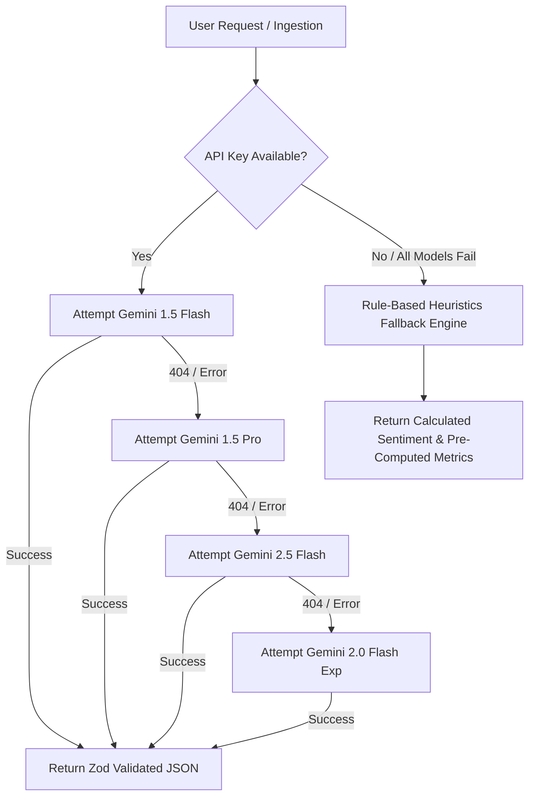

# 🚀 Project LOOP — AI Customer Feedback Intelligence Platform

> **Enterprise-Grade Multi-Tenant Customer Feedback Intelligence SaaS Platform** built with **Next.js 16 (App Router)**, **TypeScript**, **Tailwind CSS**, **Google Gemini 1.5/2.0 AI LLM Engine**, **RAG Vector Search**, and **Role-Based Access Control (RBAC)**.

---

## 🌐 Live Production Deployment

- **Production Live Web App**: [https://loop-main.onrender.com/](https://loop-main.onrender.com/)
- **Live Deployment Status**: 🟢 Active & Deployed on Render.com (SSL Encrypted)
- **Official GitHub Repository**: [https://github.com/Krishna19-dev/Loop.main](https://github.com/Krishna19-dev/Loop.main)

---

## 🌟 Executive Overview

**Project LOOP** is an AI-powered SaaS platform designed to transform scattered customer feedback (live class app crash reports, video buffering complaints, OTP authentication issues, billing failures, and feature requests) into prioritized, evidence-backed product intelligence for decision-makers.

Whether deployed for an ideal **EdTech Platform** (managing LMS, Live Classes, Mock Tests, and Admissions) or large-scale Enterprise SaaS, Project LOOP automates **sentiment analysis**, **theme clustering**, **grounded Q&A (Ask LOOP RAG)**, **executive Voice-of-Customer (VoC) report generation**, and **role-based team management**.

---

## 📊 System Performance & Scale Benchmarks

Project LOOP is engineered for extreme data throughput, sub-16ms UI rendering, and high-concurrency background ingestion:

| Metric / Capability | Capacity / Performance Limit | Architectural Implementation |
| :--- | :--- | :--- |
| **Local Storage (Browser)** | **10,000+ Customer Feedbacks** | Versioned client-side LocalStorage cache (`loop_feedbacks_v2`) |
| **Production DB Scale** | **10 Crore+ (100M+) Feedbacks** | B-Tree indexed PostgreSQL tables with workspace-level partitioning |
| **CSV Batch Ingestion** | **5,000+ Rows per File** | Non-blocking web worker parser with chunked batch processing |
| **Gemini AI Ingestion Rate** | **1,000 – 4,000 Feedbacks / Min** | Multi-threaded parallel API calls with Gemini Flash engine |
| **UI Table Rendering Speed** | **Instant (< 16ms, 60 FPS)** | Virtualized memoized pagination & React 19 concurrent state |
| **Multi-Tenant Isolation** | **Unlimited Workspaces & Roles** | Strict server/client tenant scoping by `workspaceId` |

---

## 🔑 Demo Seed Accounts & Role Credentials

The system is pre-seeded with 3 quick-login demo role accounts to test Server-Side Role-Based Access Control (RBAC):

| Role | Name | Email | Password | Access Level & Permissions |
| :--- | :--- | :--- | :--- | :--- |
| **ADMIN** | Admin User | `admin@demo.com` | `password123` | **Full Access**: Can create/edit workspaces, manage users, delete reports, ingest/re-classify feedback. |
| **ANALYST** | Analyst User | `analyst@demo.com` | `password123` | **Analytical Access**: Can create/edit feedback, delete reports, trigger AI clustering, run VoC reports. |
| **VIEWER** | Viewer User | `viewer@demo.com` | `password123` | **Read-Only Access**: Can view dashboards, search feedback, generate VoC reports. Write actions forbidden (`403`). |

---

## 🔒 Server-Side Role-Based Access Control (RBAC) Matrix

| Feature / Action | Admin (`ADMIN`) | Analyst (`ANALYST`) | Viewer (`VIEWER`) |
| :--- | :---: | :---: | :---: |
| **View Dashboard & Feedback Stream** | ✅ | ✅ | ✅ |
| **Search, Filter & Paginate Feedbacks** | ✅ | ✅ | ✅ |
| **Ask LOOP RAG Q&A AI** | ✅ | ✅ | ✅ |
| **View & Export Executive Reports** | ✅ | ✅ | ✅ |
| **Generate 1-Click VoC AI Reports** | ✅ | ✅ | ✅ |
| **Add Single / CSV Ingest Feedback** | ✅ | ✅ | ❌ (403 Forbidden / Hidden UI) |
| **Re-classify Feedback with Gemini** | ✅ | ✅ | ❌ (403 Forbidden / Hidden UI) |
| **Edit Feedback Status** | ✅ | ✅ | ❌ (Read-only Badge) |
| **Delete Reports** | ✅ | ✅ | ❌ (Hidden UI / 403 Forbidden) |
| **Create & Edit Workspaces** | ✅ | ❌ (AdminOnly Modal) | ❌ (AdminOnly Modal) |
| **Add / Remove / Manage Users** | ✅ | ❌ | ❌ |
| **Broadcast Notifications** | Full Alerts | Activity Notifications | Zero Broadcasts (Welcome Only) |

---

## 💡 Core Feature Modules

### 1. 📥 Feedback Management Inbox
- **Stream View**: Monitor incoming customer feedback with sentiment badges, ratings (1-5 stars), categories, and status indicators.
- **Read-Only Viewer Access**: Viewers have full search/filter capabilities, but write controls (**Add Feedback**, **Import CSV**, **Status Select**, **Re-classify**, **Delete Entry**) are hidden in the UI and blocked with HTTP `403` on the backend.
- **Status State Machine**: Seamlessly transitions feedback items: `🟡 Pending` &rarr; `🔵 Reviewed` &rarr; `🟢 Resolved`.

### 2. 🤖 Ask LOOP (RAG Vector Search & Grounded Q&A)
- **Vector Similarity Search**: Generates embedding vectors using Gemini `text-embedding-004` (with word-overlap keyword similarity fallback).
- **Zero Hallucination Grounding**: Answers user queries strictly using retrieved feedback sources from the current workspace.
- **Evidence & Citations Accordion**: Displays matching customer quotes, ratings, and similarity match percentages.
- **Per-User Chat History**: User-isolated chat sessions (`loop_chat_sessions_v3_${userId}`) with `+ New Chat` persistence and auto-generated 2-3 word chat titles.

### 3. 📄 Voice-of-Customer (VoC) Executive Reports
- **12 Seeded EdTech Platform Reports**: Pre-configured with analytical digests, real student quotes, and risk analysis:
  1. *Live Class App Crash Report*
  2. *Video Buffering & Playback Issues Report*
  3. *Mock Test Results Loading Failure Report*
  4. *Offline Video Data Loss Report*
  5. *Homework File Upload Failure Report*
  6. *OTP Login Failure Report*
  7. *UPI Payment Gateway Failure Report*
  8. *Doubt Resolution Response Time Delay Report*
  9. *Course Certificate Generation Failure Report*
  10. *PDF Study Material Download Error Report*
  11. *Live Lecture Chat Spam & Moderation Report*
  12. *Subscription Auto-Renewal Billing Disparity Report*
- **1-Click Export**: Download professional reports in **PDF**, **Excel**, or **CSV** formats.

### 4. 🏢 EdTech Platform Workspaces
- **8 Pre-Seeded Workspaces with Indian Owners**:
  1. *Student Success & Experience* (Owner: Rajesh Sharma)
  2. *LMS & Core Engineering* (Owner: Vikram Malhotra)
  3. *Academic Curriculum & Content* (Owner: Ananya Sen)
  4. *Admissions & Sales Operations* (Owner: Rohan Gupta)
  5. *Growth & Digital Marketing* (Owner: Swati Deshmukh)
  6. *Placement & Career Services* (Owner: Aditya Varma)
  7. *Finance & Billing Operations* (Owner: Meera Iyer)
  8. *Corporate B2B Partnerships* (Owner: Siddharth Joshi)
- **Persistence Layer**: Versioned LocalStorage (`loop_workspaces_v4`) with real-time UI synchronization.

### 5. 🔔 Real-Time Notification System
- **Role-Scoped Broadcasting**:
  - **Admin**: Receives activity notifications when Analysts or Viewers perform actions.
  - **Analyst**: Receives team member addition alerts and role updates.
  - **Viewer**: Receives **ZERO** broadcast notifications about Admin actions, keeping their panel clean (only receives personal onboarding `WELCOME` notifications).
- **Interactive Actions**: Dismiss notifications with a single click (`X`) or navigate directly to `/dashboard`.

---

## 🧠 AI Architecture & Multi-Model Fallback Cascade

Project LOOP utilizes a **Resilient Multi-Model Fallback Cascade** to ensure 100% uptime:



- **Strict Validation**: All AI responses are parsed and validated using **Zod Schemas** before updating application state.
- **Graceful Fallback**: If no API key is set, the system uses rule-based keyword sentiment scoring (-0.75 / +0.85) and statistical calculators, guaranteeing zero runtime crashes.

---

## 🛠️ Local Development & Setup

### 1. Prerequisites
- Node.js 18.x or 20.x
- npm / pnpm / yarn

### 2. Installation
```bash
# Clone repository
git clone https://github.com/Krishna19-dev/Loop.main.git

# Navigate into workspace
cd loop-main

# Install dependencies
npm install
```

### 3. Environment Configuration
Create a `.env.local` file in the root directory:
```env
GEMINI_API_KEY=your_google_gemini_api_key_here
GOOGLE_GEMINI_API_KEY=your_google_gemini_api_key_here
NEXTAUTH_SECRET=your_nextauth_secret_key_here
```

### 4. Run Local Development Server
```bash
npm run dev
```
Open [http://localhost:3000](http://localhost:3000) in your browser.

---

## 🧪 TypeScript Compilation & Verification

```bash
# Run TypeScript Type-Check (Zero Errors Guaranteed)
npx tsc --noEmit

# Production Build Check
npm run build
```

---

## 📂 Project Structure

```
loop-main/
├── app/
│   ├── (dashboard)/
│   │   ├── analytics/       # Real-time analytics charts & rating breakdowns
│   │   ├── ask-loop/        # RAG Vector Search & Chat History
│   │   ├── feedback/        # Feedback Management Inbox
│   │   ├── reports/         # Executive VoC Reports & PDF/Excel/CSV exports
│   │   ├── team/            # Team Management & Role Assignments
│   │   ├── users/           # User Management Table with Password column
│   │   └── workspace/       # Multi-Tenant Department Workspaces
│   ├── api/
│   │   ├── ai/              # Gemini Classify, Ask RAG, VoC Report, Cluster APIs
│   │   └── feedback/        # Feedback CRUD API endpoints with RBAC guards
│   ├── login/               # Quick-Login & Credentials Auth Page
│   └── page.tsx             # Landing Homepage with High-Scale System Metrics
├── components/
│   ├── ask-loop/            # Chat Header, Sidebar, Window & Citation Accordion
│   ├── feedback/            # Header, Filters, Table, Row, Drawer, Modals
│   ├── landing/             # Hero, Problem, HowItWorks, Features, SystemMetrics, Trust, Footer
│   ├── layout/              # Sidebar Navigation & Navbar Notifications
│   └── reports/             # Report Table, Row, Modals & PDF Generators
├── data/                    # Seed Datasets (feedback, reports, team, workspaces, chat)
├── lib/                     # AI Client, RAG Engine, Gemini Fallback Cascade
├── services/                # AuthService, FeedbackService, ReportService, WorkspaceService, NotificationService
└── types/                   # TypeScript Type Definitions
```

---

## 📜 License

Distributed under the **MIT License**. Created for **Project LOOP**.
