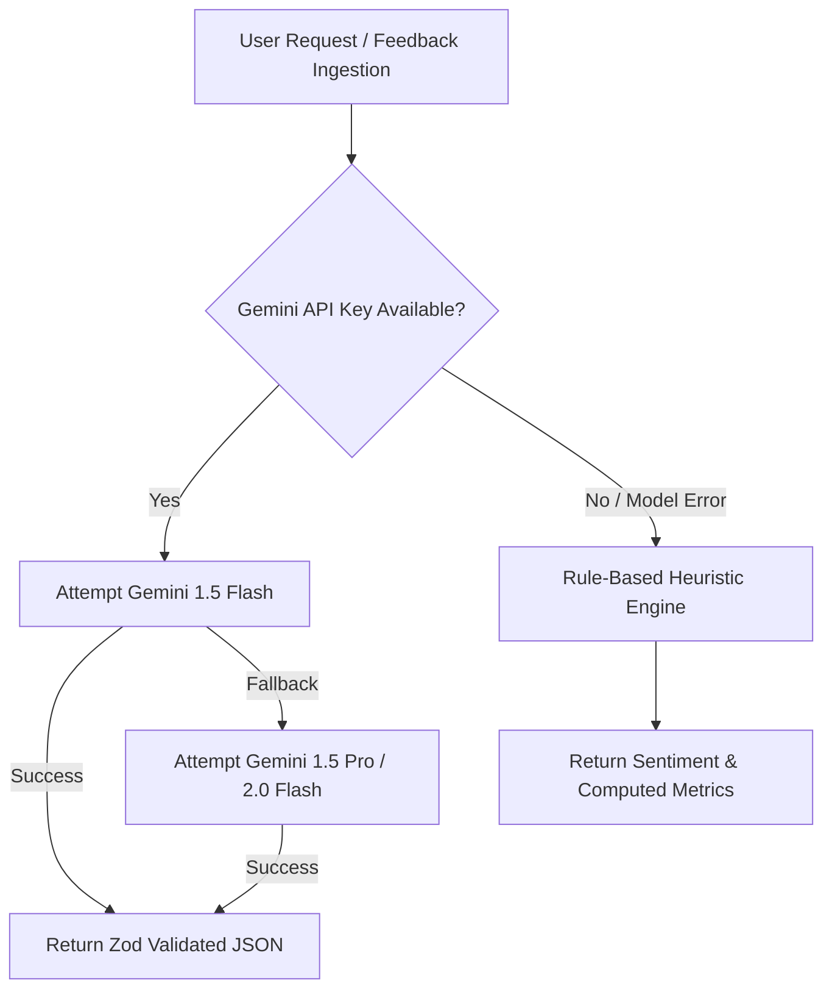

# 🚀 Project LOOP — AI Customer Feedback Intelligence Platform

> **Enterprise-Grade Multi-Tenant Customer Feedback Intelligence SaaS Platform** built with **Next.js 16 (App Router)**, **TypeScript**, **Tailwind CSS**, **Google Gemini AI Engine**, **RAG Vector Search**, and **Role-Based Access Control (RBAC)**.

---

## 🌐 Live Production Deployment

- **Production Web App**: [https://loop-main.onrender.com/](https://loop-main.onrender.com/)
- **Deployment Status**: 🟢 Active & Deployed on Render.com
- **GitHub Repository**: [https://github.com/Krishna19-dev/Loop.main](https://github.com/Krishna19-dev/Loop.main)

---

## 🎥 Product Demo & Video Walkthrough

<video src="./VID_20260815_183049.mp4" controls width="100%" style="max-width: 100%;">
  Your browser does not support the video tag. You can <a href="./VID_20260815_183049.mp4">download/watch the video file directly</a>.
</video>

> 📌 **Direct Link**: [Watch / Download Demo Video (`VID_20260815_183049.mp4`)](./VID_20260815_183049.mp4)

---

## 🌟 Overview

**Project LOOP** is an AI-powered SaaS platform designed to transform scattered customer feedback (support tickets, app crash reports, feature requests) into prioritized, evidence-backed product intelligence.

It automates **sentiment analysis**, **theme clustering**, **grounded Q&A (Ask LOOP RAG)**, **executive Voice-of-Customer (VoC) report generation**, and **role-based team management**.

---

## 🧠 System Architecture & AI Cascade

Project LOOP utilizes a **Resilient Multi-Model Fallback Cascade** to ensure reliable AI uptime:



- **RAG Vector Search**: Contextual similarity search powered by Gemini embeddings (`text-embedding-004`) with keyword overlap fallback.
- **Strict Schema Validation**: All AI responses are structured and verified with **Zod Schemas**.

---

## 🔑 Demo Seed Accounts

| Role | Name | Email | Password | Access Level |
| :--- | :--- | :--- | :--- | :--- |
| **ADMIN** | Admin User | `admin@demo.com` | `password123` | Full Access (workspaces, user management, feedback CRUD) |
| **ANALYST** | Analyst User | `analyst@demo.com` | `password123` | Analytical Access (feedback triage, AI clustering, VoC reports) |
| **VIEWER** | Viewer User | `viewer@demo.com` | `password123` | Read-Only Access (dashboard, search, Ask LOOP RAG) |

---

## 💡 Core Modules

1. **📥 Feedback Inbox**: Sentiment triage, category tagging, and status tracking (`Pending` → `Reviewed` → `Resolved`).
2. **🤖 Ask LOOP (RAG Q&A)**: Grounded AI question answering with exact evidence quotes and isolated chat history.
3. **📄 VoC Executive Reports**: 1-click executive digests with PDF, Excel, and CSV export.
4. **🏢 Multi-Tenant Workspaces**: Scoped department workspaces with Indian regional team leads.
5. **🔒 Role-Based Access Control**: Strict client and server-side RBAC scoping for Admin, Analyst, and Viewer roles.

---

## 🛠️ Quick Local Setup

```bash
# 1. Clone repository
git clone https://github.com/Krishna19-dev/Loop.main.git
cd loop-main

# 2. Install dependencies
npm install

# 3. Configure environment (.env.local)
GEMINI_API_KEY=your_gemini_api_key_here
NEXTAUTH_SECRET=your_nextauth_secret_here

# 4. Start local server
npm run dev
```

Open [http://localhost:3000](http://localhost:3000) in your browser.

---

## 📜 License

Distributed under the **MIT License**. Created for **Project LOOP**.
